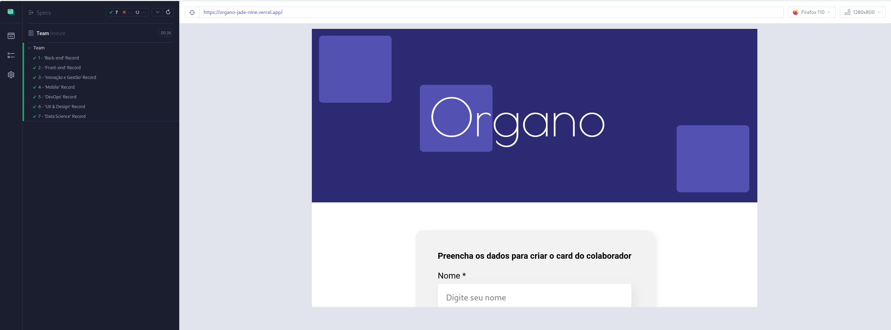

This is an automation project for [Organo](https://github.com/Cledersonbc/organo). This project is using BDD (Behavior-driven Development) with Gherkin language.

<p style="text-align: center">
    
</p>

# Install Node dependecies
```shell
npm install
```

# Run Cypress project

## GUI execution
```shell
npm run cypress:open
```

## CLI execution
```shell
npm run cypress:run
```

## Testing report
```shell
npm run report
```

# Project Structure

If you have never worked with Cypress, here are a general explanation about the structure of this project:

### Main
* :test_tube: **e2e/**: test cases and scenarios
  * files.feature: high level test cases using Gherkin
  * files.cy.js: test cases specification
* :floppy_disk: **fixtures/**: external pieces of data that are used to set up and provide input for test cases
* :scroll: **support/**: store helper files and scripts that can be used across multiple tests
  * pages/: store Page Object models
  * commands.js: place to store custom commands like cy.myComand()
  * cucumber-html-report.js: report generator for tests execution
  * util.js: reusable codes
  * index.d.ts: intellisense VS Code helper
  * e2e.js: entry point (main file)
* :gear: **cypress.config.js**: Cypress configuration file

### Aditional folders
* :cucumber: **cucumber-json/**: JSON folder about the tests for report
* :bar_chart: **report/**: testing reports
* :national_park: **screenshots/**: print of tests
* :film_strip: **videos/**: test records in video format (for CLI execution)

# For knowledge
* [Page Object Pattern - Article of Martin Fowler](https://martinfowler.com/bliki/PageObject.html)
* [Page Objects and App Actions in Cypress - Cypress Blog](https://www.cypress.io/blog/2019/01/03/stop-using-page-objects-and-start-using-app-actions/)
* [Cypress Doc](https://docs.cypress.io/guides/overview/why-cypress)
* [Behavior-driven Development - Wikipedia](https://en.wikipedia.org/wiki/Behavior-driven_development)
* [Gherkin and Cucumber Reference](https://cucumber.io/docs/gherkin/reference/)
# Requirements
* [Node](https://nodejs.org/en/download/)
* [Git](https://git-scm.com/downloads)
